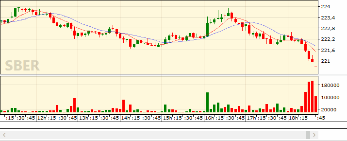
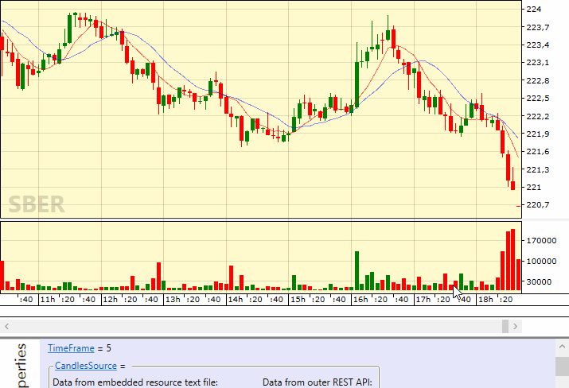
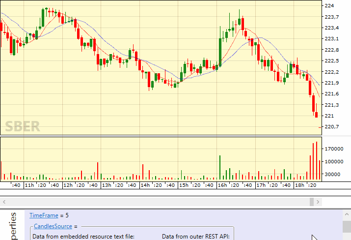
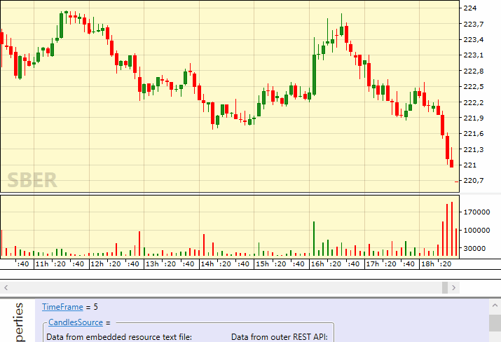
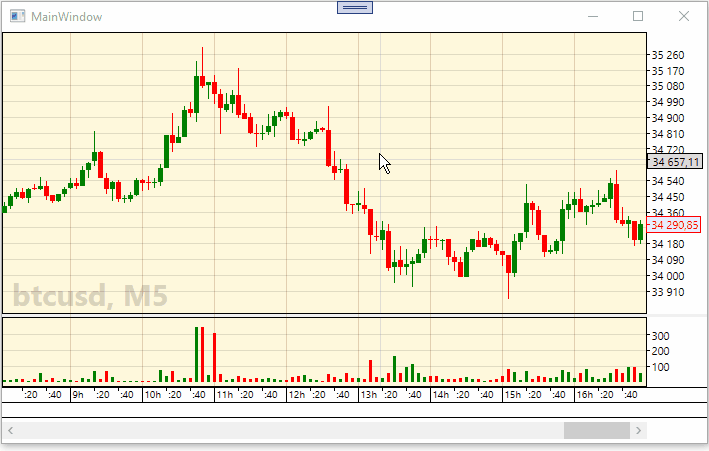

#  FancyCandles

FancyCandles is a WPF library that lets you add a professional candlestick charts to your applications. A wide variety of settings provides rich customization abilities. Traditionally candlesticks are used for visualizing a price history of financial instruments - stocks, currency pairs or futures. But you can utilize the candlestick charts for plotting any time series converted to OHLC format (Open, High, Low, Close).

FancyCandles is an open source library under the GPLv3 license. That lets you use the FancyCandles candlestick charts in your internal trading/analytical software applications or another open source projects absolutely free. A licensing under permissive licenses is available for a commercial usage in a proprietary software projects.

## Chart settings
You can open the properties window of the candlestick chart control by right-clicking on the chart area and selecting Settings in the context menu. 

To save or load settings from a file select the appropriate context menu items. You can do the same via API methods.

## Technical indicators
The candlestick chart control contains a collection of built-in technical indicators. Yet, you or even users of your application can expand it with custom add-in overlay indicators. For more information about it read [this article](https://gellerda.github.io/FancyCandles/articles/creating_overlay_indicator.html) in the documentation.

## Candle Providers
You can implement your own candle data provider to use it in conjunction with the FancyCandles candlestick chart control, so that your application users can select a security from a provided financial instrument list via the context menu.

## Demo app in Microsoft Store
Look at [FancyCandles Demo](https://www.microsoft.com/store/apps/9NQ2C465CS0C) app to see the FancyCandles candlestick chart control in action. Moreover, you can use this app as a simplistic interactive documentation - change class properties from the list, and see how they affect the appearance and behavior of the control. The easiest and most effective way to learn about the features and functionality of our product!

## Documentation and Quick start
You can read the [documentation online](https://gellerda.github.io/FancyCandles/). The [Getting started](https://gellerda.github.io/FancyCandles/articles/creating_candlestick_chart.html) section of the documentation is the best way to take the initial steps.

## Got questions?
If you have any questions or suggestions, don't hesitate to submit a new GitHub issue.

## License
[GNU GPLv3 license](https://github.com/gellerda/FancyCandles/blob/master/LICENSE).
