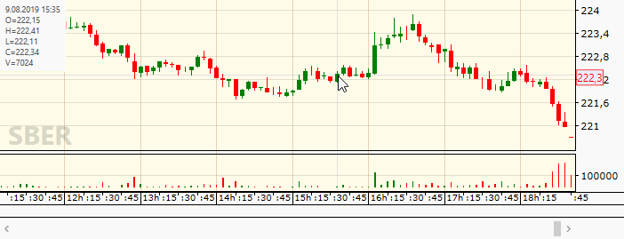

FancyCandles WPF library lets you add professional candlestick charts to your applications. A wide variety of settings are available for fine tuning. Traditionally candlesticks are used for visualizing a price history of any financial instruments - stocks, currency pairs or futures. But you can utilize candlestick charts for plotting any time series that contain OHLC (t) components: {t - time, O - Open, H - High, L - Low, C - Close}.

> 

FancyCandles is an open source library under the GPLv3 license. That lets you use FancyCandles candlestick charts in your internal trading/analytical software applications or another open source projects absolutely free. A licensing under permissive licenses is available for a commercial usage in a proprietary software projects.

<kbd></kbd>

# Documentation and Quick start
You can read the [documentation online](https://gellerda.github.io/FancyCandles/) or [download a local version](https://gellerda.github.io/FancyCandles/download/download_doc.html).

The [Getting started](https://gellerda.github.io/FancyCandles/articles/creating_candlestick_chart.html) section of the documentation is the best way to take the initial steps.

# Got questions?
If you have any questions or suggestions, don't hesitate to submit a new GitHub issue.

# License
[GNU GPLv3 license](https://github.com/gellerda/FancyCandles/blob/master/LICENSE).
