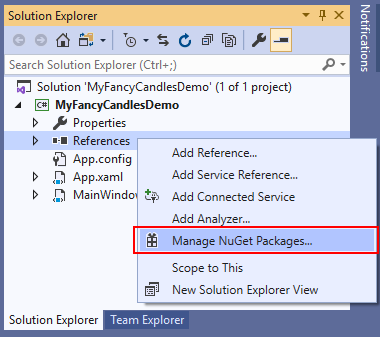
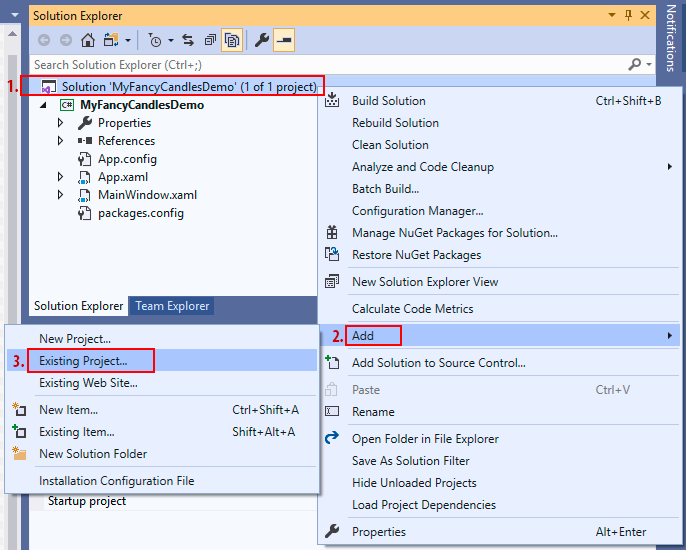
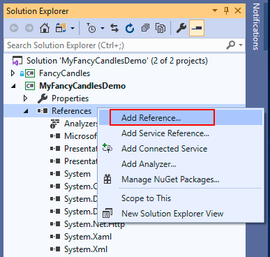
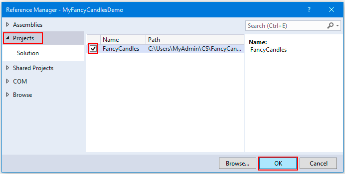

# Consuming FancyCandles in your WPF (.NET Framework) project
To use the FancyCandles library in your project you have two options:

 &nbsp;&nbsp;&nbsp;&nbsp;&nbsp;&nbsp;**A)** To [install the FancyCandles NuGet package](#nuget_package) in your project. 
 &nbsp;&nbsp;&nbsp;&nbsp;&nbsp;&nbsp;**B)** To [add the FancyCandles project](#add_project) to your solution.

If you are planning to change the source code of the FancyCandles library for your specific needs or to contribute to its open source project, then your choice is **B**.
Otherwise, you don't need to be able to change the source code of the FancyCandles library, and your choice is **A**.

# A) Installing FancyCandles NuGet package in your project
1. In Visual Studio **Solution Explorer**, right-click on **References** of your project and select **Manage NuGet Packages....**  

1. In **NuGet Package Manager** select the **Browse** tab and type *FancyCandles* in the search box. Select **FancyCandles** from the list of filtered packages. Select a desired version of the FancyCandles package (the latest is recommended) and click the **Install** button.  

1. Accept a license prompt.

1. If everything went successfully, Visual Studio installs the FancyCandles package into your project. Once the installation is complete, the FancyCandles package appears on the **Installed** tab of **NuGet Package Manager**, and in the **References** list of your project in **Solution Explorer**.  

Now you can go on to [create your first FancyCandles candlestick chart](creating_candlestick_chart.md) in your application.

# B) Adding FancyCandles project to your solution

1. Clone or Download the [FancyCandles repository](https://github.com/gellerda/FancyCandles) to your computer.  
    

1. Add the FancyCandles project to the solution of your project, which going to use the candlestick chart control:
    * In **Solution Explorer**, right-click on the Solution of your project and select **Add/Existing project...**.  
      
    * Select a path to the project file **FancyCandles.csproj** of the FancyCandles project (eg. *.../FancyCandles/FancyCandles.csproj*) and click **Open**.  

1. Add to your project a reference to the FancyCandles project:
    * Right-click on **References** under your project in **Solution Explorer** and click **Add reference...**.  
      
    * In the **Projects** tab find the **FancyCandles** project row and check it. Click **OK**.  
     

Now you can go on to [create your first FancyCandles candlestick chart](creating_candlestick_chart.md) in your application.
