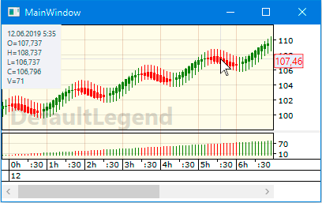

# Populating CandleChart with candles

After [the empty instance of the CandleChart control has been created](creating_candlestick_chart.md), you need to populate it with candles:

1. The [CandleChart](https://gellerda.github.io/FancyCandles/api/FancyCandles.CandleChart.html) control requires the data source of its candle collection ([CandlesSource property](https://gellerda.github.io/FancyCandles/api/FancyCandles.CandleChart.html#FancyCandles_CandleChart_CandlesSource)) to be of type [ObservableCollection\<](https://docs.microsoft.com/ru-ru/dotnet/api/system.collections.objectmodel.observablecollection-1?view=netframework-4.8)[ICandle\>](https://gellerda.github.io/FancyCandles/api/FancyCandles.ICandle.html). Therefore, add to your project a new **class Candle** that implements the [ICandle](https://gellerda.github.io/FancyCandles/api/FancyCandles.ICandle.html) interface:

    ```cs
        public class Candle : FancyCandles.ICandle
        {
            public DateTime t { get; set; }
            public double O { get; set; }
            public double H { get; set; }
            public double L { get; set; }
            public double C { get; set; }
            public long V { get; set; }

            public Candle(DateTime t, double O, double H, double L, double C, long V)
            {
                this.t = t;
                this.O = O;
                this.H = H;
                this.L = L;
                this.C = C;
                this.V = V;
            }
        }
    ```
1. For convenience, add some *using* directives to **MainWindow.xaml.cs** of your project:

    ```cs
        using System.Collections.ObjectModel;
        using FancyCandles;
    ```
1. In **MainWindow.xaml.cs** of your project, in the constructor of the **MainWindow class**:

    - Create an instance of [ObservableCollection\<](https://docs.microsoft.com/ru-ru/dotnet/api/system.collections.objectmodel.observablecollection-1?view=netframework-4.8)[ICandle\>](https://gellerda.github.io/FancyCandles/api/FancyCandles.ICandle.html), which will be used as the data source for the [CandleChart](https://gellerda.github.io/FancyCandles/api/FancyCandles.CandleChart.html) control.
      ```cs
          ObservableCollection<ICandle> candles = new ObservableCollection<ICandle>();
      ```
    - In the constructor of the **MainWindow** class populate this collection with some data. In this example, we will generate a meaningless set of **Candle** instances:
      ```cs
          DateTime t0 = new DateTime(2019, 6, 11, 23, 40, 0);
          for (int i = 0; i < 500; i++)
          {
              double p0 = Math.Round(Math.Sin(0.3*i) + 0.1*i, 3);
              double p1 = Math.Round(Math.Sin(0.3*i + 1) + 0.1*i, 3);
              candles.Add(new Candle(t0.AddMinutes(i * 5),
                          100 + p0, 101 + p0, 99 + p0, 100 + p1, i));
          }
      ```
    - Set the [DataContext](https://docs.microsoft.com/en-us/dotnet/api/system.windows.frameworkelement.datacontext?view=netframework-4.8) property to this collection of candles:
      ```cs
          DataContext = candles;
      ```
    As a result, the constructor of your **MainWindow class** may looks like this:
    ```cs
        public MainWindow()
        {
            InitializeComponent();

            /// ... some code

            ObservableCollection<ICandle> candles = new ObservableCollection<ICandle>();

            DateTime t0 = new DateTime(2019, 6, 11, 23, 40, 0);
            for (int i = 0; i < 250; i++)
            {
                double p0 = Math.Round(Math.Sin(0.3*i) + 0.1*i, 3);
                double p1 = Math.Round(Math.Sin(0.3*i + 1) + 0.1*i, 3);
                candles.Add(new Candle(t0.AddMinutes(i * 5),
                            100 + p0, 101 + p0, 99 + p0, 100 + p1, i));
            }

            DataContext = candles;
        }
    ```
1. In **MainWindow.xaml** of your project, set the [CandlesSource](https://gellerda.github.io/FancyCandles/api/FancyCandles.CandleChart.html#FancyCandles_CandleChart_CandlesSource) attribute for the [CandleChart](https://gellerda.github.io/FancyCandles/api/FancyCandles.CandleChart.html) element:

    ```cs
        <fc:CandleChart CandlesSource="{Binding Path=.}"  xmlns:fc="clr-namespace:FancyCandles;assembly=FancyCandles"/>
    ```

Finally, a set of candles should appear in your CandleChart control.<br><br>
    
